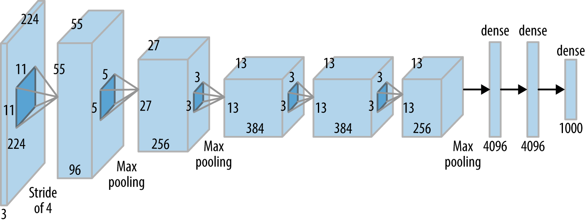

# AlexNet_Cifar10

#### Este projeto utiliza o conjunto de dados CIFAR10 para o treinar um modelo de rede neural convolucional chamado de AlexNet. O modelo desse algoritmo é dado na imagem abaixo:

  
  
#### O conjunto de dados CIFAR-10 contém 60.000 imagens coloridas, cada uma com dimensões de 32x32px . O conteúdo das imagens no conjunto de dados é uma amostra de 10 classes. São elas: 
- Avião
- Automóvel
- Pássaro
- Gato
- Veado
- Cachorro
- Sapo
- Cavalo
- Navio
- Caminhão

